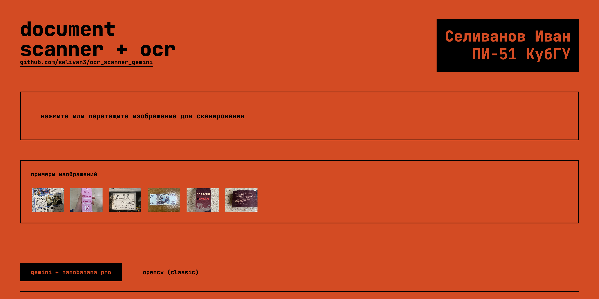
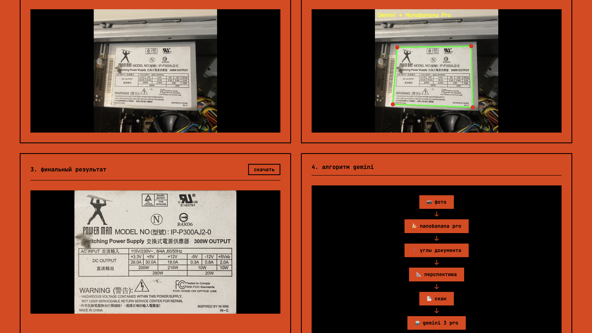
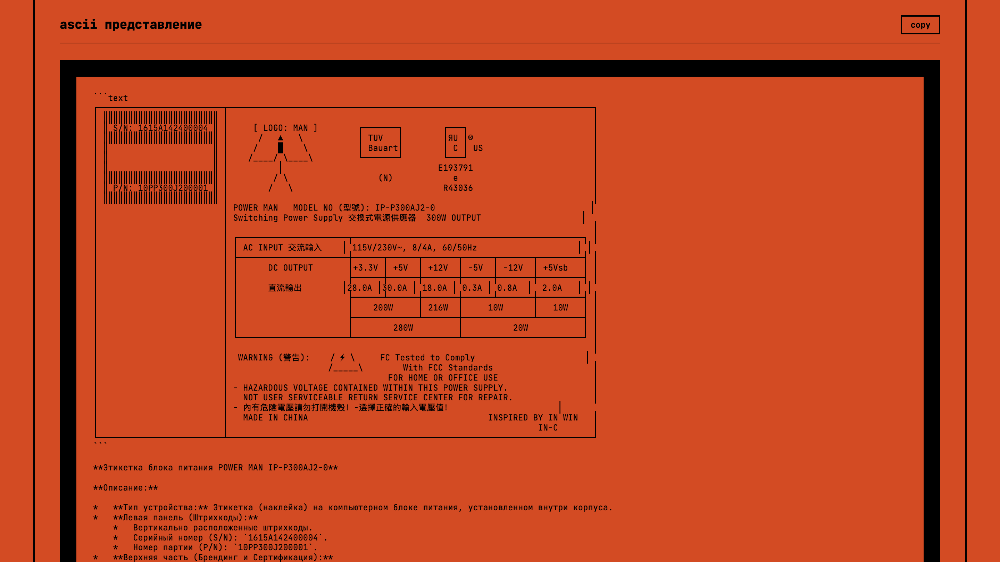
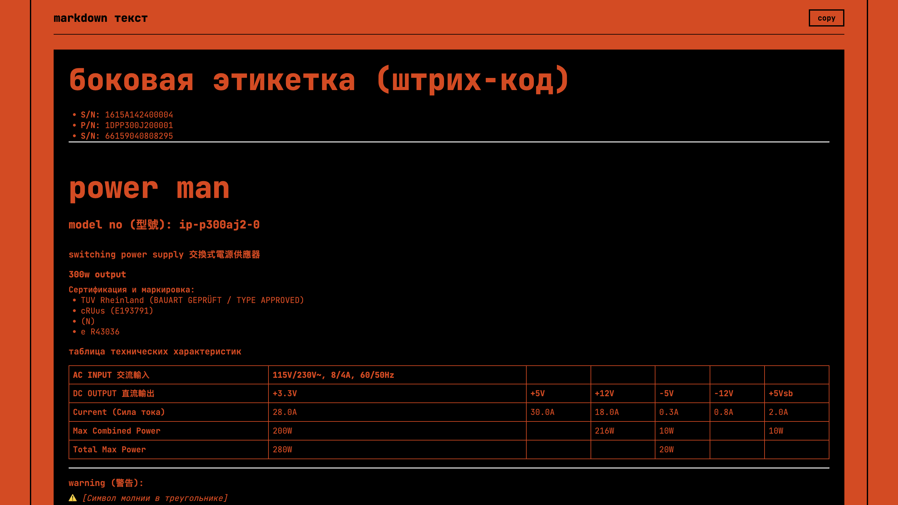
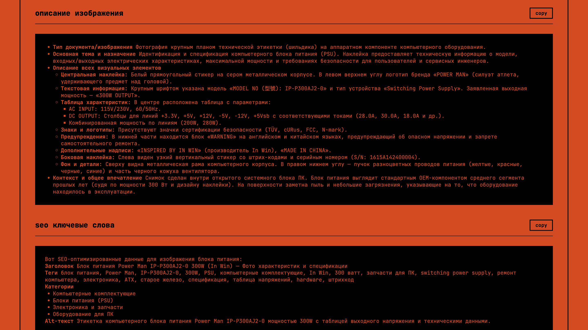

# 📄 OCR Scanner с Gemini AI

**Автор:** Селиванов Иван, ПИ-51, КубГУ



---

## 🎬 Демонстрация

▶️ **[Видеобзор](https://youtu.be/yO54KFo9E1g)**

---

## 🎯 Что делает программа

Веб-приложение для автоматического сканирования документов с распознаванием текста:

1. **Загружаете фото** документа (снятого под любым углом)
2. **AI находит углы** листа бумаги
3. **Выравнивает** документ (убирает перспективу)
4. **Извлекает текст** (OCR) и создаёт описание

---

## 🚀 Быстрый старт

### 1. Установка зависимостей

```bash
pip install flask opencv-python google-genai pillow numpy
```

### 2. Настройка API ключа

Скопируйте файл конфигурации:
```bash
cp config.example.py config.py
```

Откройте `config.py` и вставьте ваш Gemini API ключ:
```python
GEMINI_API_KEY = "ваш_ключ_здесь"
```

**Где взять ключ:** https://aistudio.google.com/apikey

### 3. Запуск

```bash
python app.py
```

Откройте в браузере: **http://localhost:8000**

---

## 🛠 Два режима работы

| Режим | Детекция углов | OCR |
|-------|---------------|-----|
| **Gemini + Nanobanana** | AI (Nanobanana Pro) | Gemini 3 Pro |
| **OpenCV (classic)** | Алгоритмы OpenCV | ❌ нет |

---

## 📁 Структура проекта

```
ocr_scanner/
├── app.py              # Точка входа
├── config.py           # API ключи (не в git!)
├── src/
│   ├── domain/         # Сущности и интерфейсы
│   ├── infrastructure/ # OpenCV, Gemini
│   ├── application/    # Бизнес-логика
│   └── presentation/   # HTTP роуты
├── templates/          # HTML
└── static/             # Статика
```

---

## 📋 Алгоритм Gemini режима

```
📷 Фото → 🍌 Nanobanana Pro → 📍 Углы → 📐 Перспектива → 📄 Скан → 🤖 Gemini → 📝 OCR
```

---

## 📋 Алгоритм OpenCV режима

1. Конвертация в оттенки серого
2. Гауссово размытие
3. Детекция границ (Canny)
4. Морфологические операции
5. Поиск контуров
6. Перспективное преобразование
7. Повышение резкости
8. Бинаризация

---

## 📦 Зависимости

- Python 3.10+
- Flask 3.x
- OpenCV 4.x
- google-genai
- Pillow
- NumPy

---

## 🖼 Пример работы






